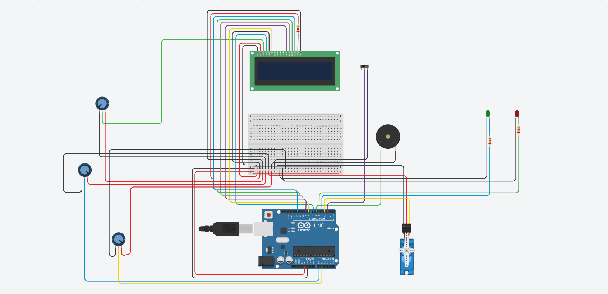
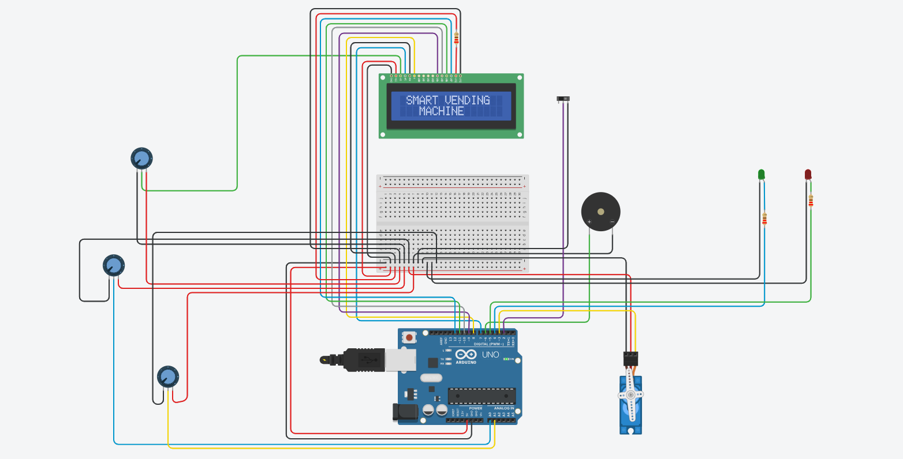
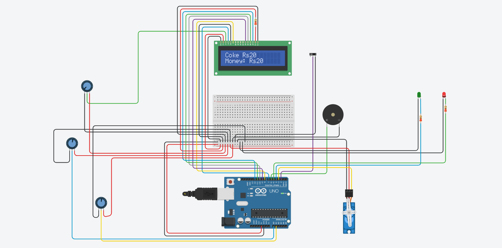
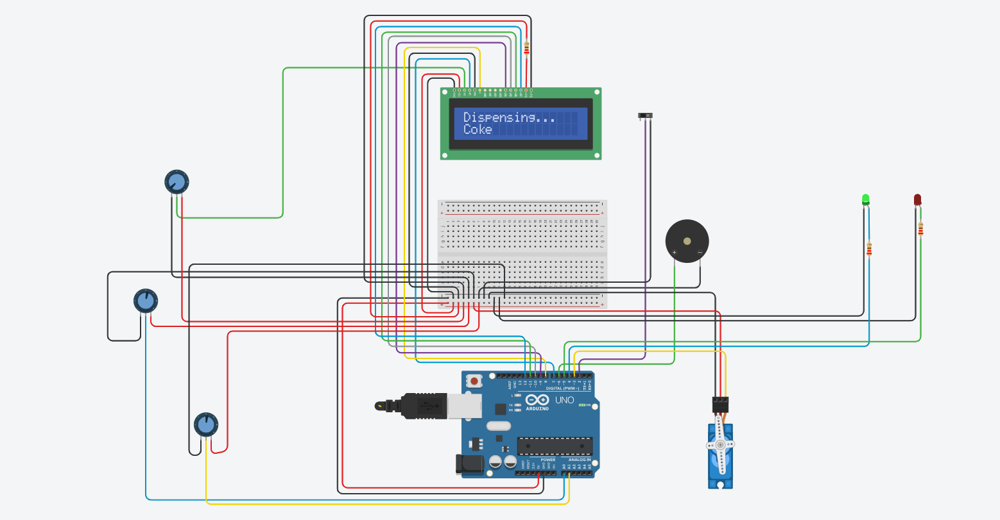
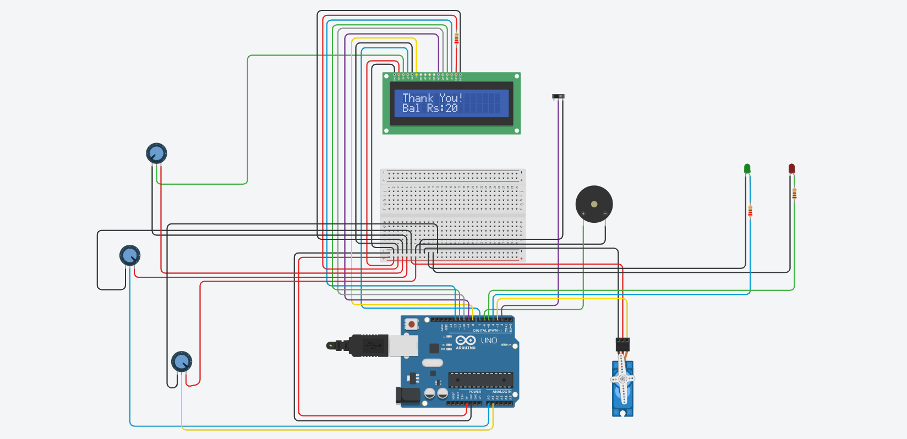
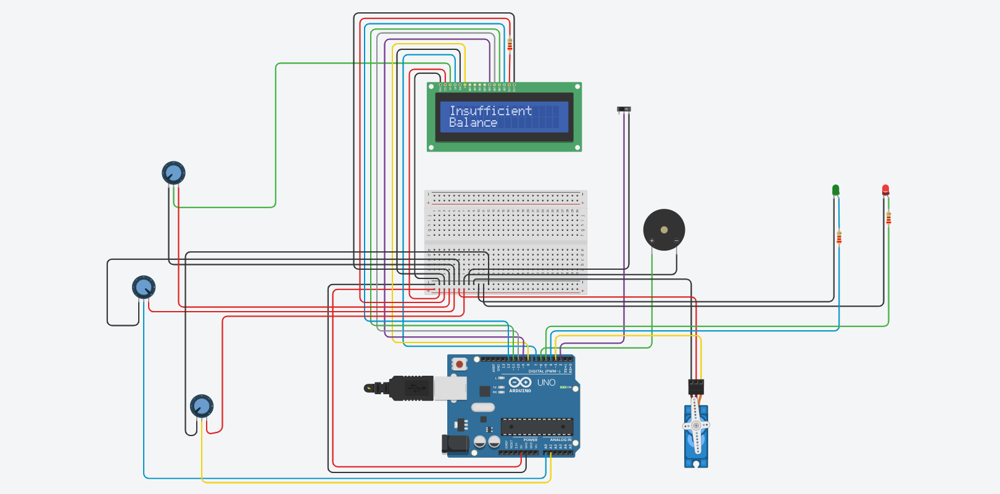

# 🥤 Intelligent Automated Vending Machine System

## 🎥 Project Demonstration

A complete simulation video (`demo_video.mp4`) is included in this repository demonstrating:

* Product Selection
* Payment Processing
* Product Dispensing
* Balance Calculation
* Successful Transactions
* Error Handling for Insufficient Balance

---

## 📖 Overview

The Intelligent Automated Vending Machine System is an Arduino-based Embedded Systems project developed using the Tinkercad simulation platform.

The system enables users to select products, simulate digital payments, verify available balance, calculate and return change, dispense products using a servo motor, and provide real-time feedback through an LCD display, LEDs, and buzzer notifications.

This project demonstrates practical applications of Embedded Systems, Automation, Human-Machine Interaction, and Smart Retail Technologies.

---

## 🔌 Circuit Diagram

  

The complete vending machine system integrates an Arduino UNO, LCD display, potentiometers for product selection and payment simulation, servo motor for dispensing, LEDs for status indication, and a buzzer for user notifications.

---

## 📸 System Demonstration

### 🚀 Startup Screen

  

The system initializes and displays a welcome message while preparing all modules for operation.

---

### 🥤 Product Selection

  

Users can browse and select products using the product selection potentiometer.

---

### ✅ Successful Purchase

  

The system verifies the payment amount, dispenses the selected product, and confirms the successful transaction.

---

### 💰 Balance Return

  

Any remaining balance after the purchase is automatically calculated and displayed to the user.

---

### ⚠️ Insufficient Balance Detection

  

If the inserted amount is lower than the product cost, the system rejects the transaction and displays an error message.

---

## ✨ Key Features

✅ Product Selection Interface

✅ Digital Payment Simulation

✅ Automated Product Dispensing

✅ Balance Return Calculation

✅ LCD-Based User Interface

✅ Green LED Success Indication

✅ Red LED Error Indication

✅ Buzzer Notifications

✅ Insufficient Balance Detection

✅ Automated Transaction Workflow

---

## 🛠️ Components Used

| Component        | Quantity |
| ---------------- | -------- |
| Arduino UNO      | 1        |
| LCD 16x2 Display | 1        |
| Potentiometers   | 2        |
| Servo Motor      | 1        |
| Slide Switch     | 1        |
| Green LED        | 1        |
| Red LED          | 1        |
| Piezo Buzzer     | 1        |
| Breadboard       | 1        |
| Jumper Wires     | Multiple |

---

## ⚙️ System Workflow

1. User selects a product using the product selection potentiometer.
2. User inserts virtual money using the payment potentiometer.
3. The LCD displays the selected product and payment amount.
4. Purchase is confirmed using the slide switch.
5. The system verifies whether sufficient payment has been provided.
6. If valid, the servo motor dispenses the selected product.
7. Remaining balance is calculated and displayed.
8. Green LED and buzzer indicate successful purchase.
9. Red LED and warning messages are activated for insufficient balance conditions.

---

## 🎯 Demonstrated Functionalities

* Product Selection
* Digital Payment Processing
* Payment Verification
* Product Dispensing
* Balance Calculation
* LCD-Based User Feedback
* Error Detection
* Visual and Audio Notifications

---

## 💻 Software Used

* Tinkercad
* Arduino IDE
* GitHub

---

## 🚀 Future Enhancements

* RFID-Based Smart Payments
* QR Code Payment Integration
* Inventory Monitoring System
* IoT-Based Remote Monitoring
* Mobile Application Support
* Cloud-Based Analytics Dashboard
* Smart Stock Management
* AI-Based Product Recommendations

---

## 📈 Project Outcomes

* Automated Product Dispensing
* Efficient Payment Verification
* Real-Time User Feedback
* Accurate Balance Calculation
* Enhanced User Experience
* Practical Embedded Systems Implementation
* Smart Retail Automation Demonstration

---

## 👩‍💻 Author

**Aneesa Pattan**

Electronics and Communication Engineering Student

Interested in:

* Embedded Systems
* IoT
* VLSI Design
* Verilog HDL
* Digital Electronics
* Automation Systems

⭐ If you found this project useful, consider giving it a star.

